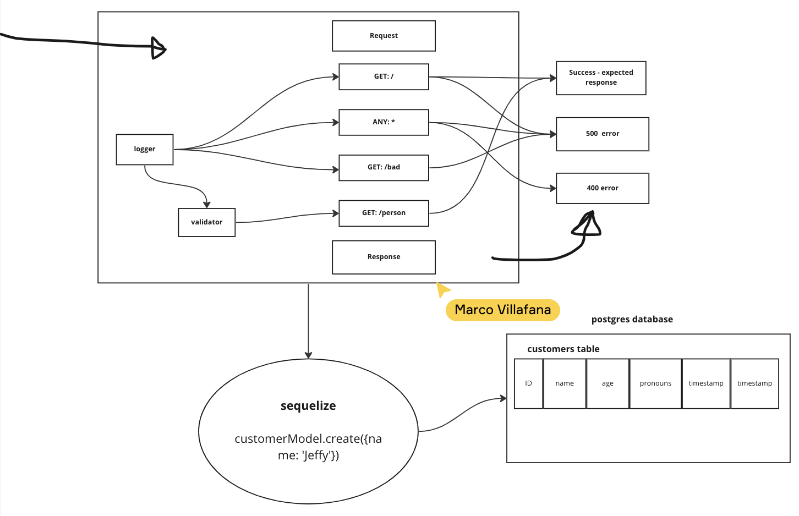

# LAB - Class 03

## Project: basic API server

### Author: Brenda Jow

### Problem Domain  

build a REST API using Express. Use postgres to handle database.

### Links and Resources

- [GitHub Actions ci/cd](https://github.com/brenda70904/basic-api-server/actions)
<!-- - [back-end server url]() -->
<!-- - [front-end application](http://xyz.com) (when applicable) -->

### Setup

#### `.env` requirements 

DATABASE_URL

#### How to initialize/run your application

run the test : `npm start`
start server: `nodemon`
start database: `psql`

#### How to use your library

N/A

#### Features / Routes

- Feature One: perfrom CURD operation in databse.

#### Tests

- How do you run tests?

`npm start` to run the test.

library : Jest, Supertest, 

- Any tests of note?

N/A 

- Describe any tests that you did not complete, skipped, etc
wasn't able to get the full CRUD performing.

#### UML

